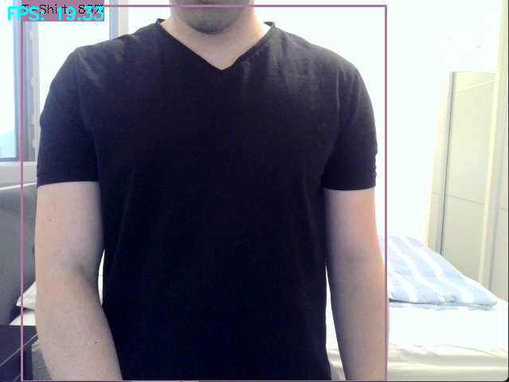
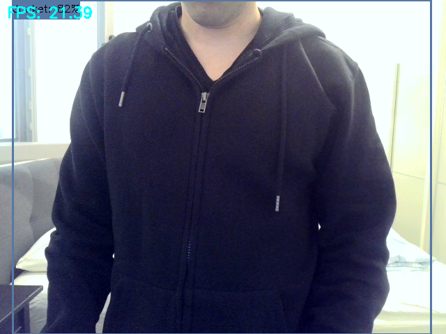

# 🧥 Clothing Detection and Weather Advice System

This project is a real-time clothing detection system using a YOLO model. It detects specific clothing items via webcam and provides smart dressing advice based on current weather at your location — with automatic fallback to Tel Aviv if GPS lookup fails.

## 👕 Supported Clothing Classes
The model is trained to detect the following clothing types:
- Jacket
- Jeans
- Jogger
- Polo
- Shirt
- Short
- T-Shirt
- Trouser


## 📌 Project Workflow

### 1. 🔖 Data Labeling
Clothing images were labeled using [Label Studio](https://labelstud.io/) — a powerful open-source data annotation tool. After annotation, Label Studio exported the labeled data in a `data.zip` file containing all annotations and images.

### 2. 🧠 Model Training
The YOLO model was trained using a script called `Train_YOLO_Models.ipynb`. It loads the labeled dataset, configures training parameters, and produces a YOLOv11-compatible `.pt` model (`my_model.pt`).

### 3. 🎥 Real-Time Detection
A custom script `yolo_detect.py` performs:
- Real-time detection via USB webcam
- Drawing bounding boxes around detected clothing items
- Calculating FPS for performance feedback
- Saving snapshots with a keypress

### 4. 🌍 GPS-Based Weather Dressing Advice
After detection, the script:
- Automatically detects your approximate location using [ipinfo.io](https://ipinfo.io/)
- Fetches the current temperature using the [OpenWeather API](https://openweathermap.org/)
- Falls back to **Tel Aviv** if location can't be determined
- Compares detected clothing items against temperature ranges
- Prints real-time dressing advice based on weather

### 5. 🧠 Train on Your Own Dataset

You can easily train the model on your own custom dataset!

### Steps:
1. **Label your images** using [Label Studio](https://labelstud.io/), an open-source data annotation tool.
2. Export the labeled data as a `data.zip` file (containing both images and annotations).
3. Run and follow the instruction of the training script:
   ```bash
   python Train_YOLO_Models.ipynb
## 🛠️ Requirements

- Python 3.8+
- [Ultralytics YOLOv11](https://docs.ultralytics.com/)
- OpenCV
- NumPy
- Requests

Install dependencies:

```bash
pip install ultralytics opencv-python numpy requests
```
## 📸 Examples

<p align="center">
  
  
</p>